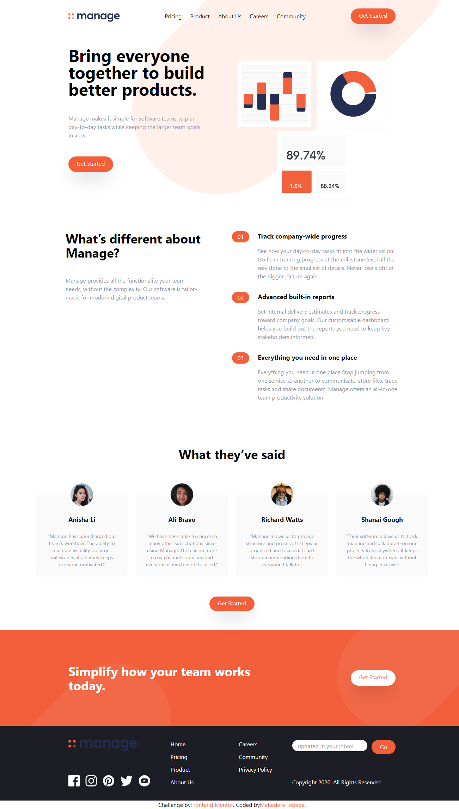

# Frontend Mentor - Manage landing page solution
This is a solution to the [Manage landing page challenge on Frontend Mentor](https://www.frontendmentor.io/challenges/manage-landing-page-SLXqC6P5). Frontend Mentor challenges help you improve your coding skills by building realistic projects. 

## Table of contents
- [Overview](#overview)
- [The challenge](#the-challenge)
- [Screenshot](#screenshot)
- [Links](#links)
- [Built with](#built-with)
- [What I learned](#what-i-learned)
- [Author](#author)
## Overview
### The challenge

Users should be able to:

- View the optimal layout for the site depending on their device's screen size
- See hover states for all interactive elements on the page
- See all testimonials in a horizontal slider
- Receive an error message when the newsletter sign up `form` is submitted if:
  - The `input` field is empty
  - The email address is not formatted correctly

### Screenshot

### Links
- Live Site URL: [https://manage-landing-page-woad-three.vercel.app/]

### Built with
- TailwindCSS
- JavaScript
- Mobile-first workflow

### What I learned

In completing this project, I gained valuable experience with Tailwind CSS and honed my skills in managing responsive layouts across various screen sizes. One particular challenge I tackled was efficiently displaying testimonials and updating the progress bar based on user interaction. Through this, I deepened my understanding of event handling and DOM manipulation in JavaScript.

## Author
- Website - Mahedere Tebebe [https://portfolio-two-beta-24.vercel.app/]
- Frontend Mentor - [@yhttps://www.frontendmentor.io/profile/Mahedere]
- Linkedin - [https://www.linkedin.com/in/mahedere-tebebe/]